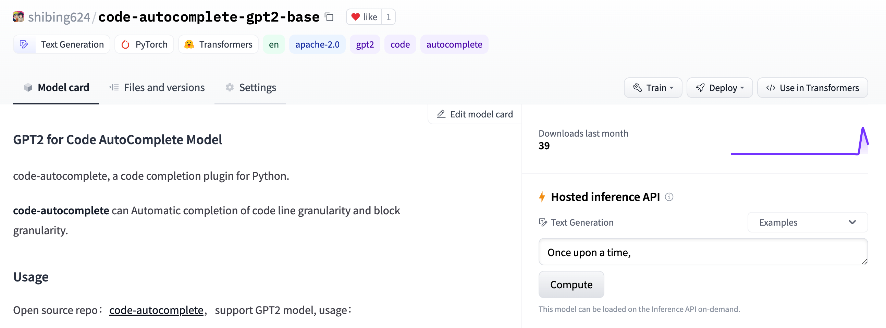
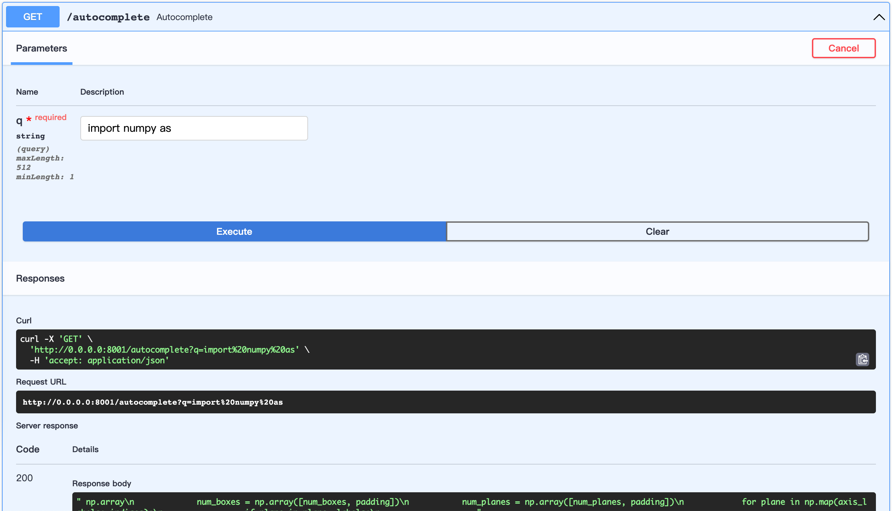

[](https://badge.fury.io/py/code-autocomplete)
[](CONTRIBUTING.md)
[](https://github.com/shibing624/code-autocomplete/graphs/contributors)
[](LICENSE)
[](requirements.txt)
[](https://github.com/shibing624/code-autocomplete/issues)
[](#Contact)

# Code AutoComplete

code-autocomplete, a code completion plugin for Python.

**code-autocomplete** can automatically complete the code of lines and blocks with GPT2.

**Guide**

- [Feature](#Feature)
- [Install](#install)
- [Usage](#usage)
- [Contact](#Contact)
- [Citation](#Citation)
- [Reference](#reference)

# Feature

- GPT2-based code completion
- Code completion for Python, other language is coming soon
- Line and block code completion
- Train(Fine-tune GPT2) and predict model with your own data


# Demo


HuggingFace Demo: https://huggingface.co/spaces/shibing624/code-autocomplete

# Install

```
pip3 install torch # conda install pytorch
pip3 install -U code-autocomplete
```

or

```
git clone https://github.com/shibing624/code-autocomplete.git
cd code-autocomplete
python3 setup.py install
```

# Usage

## Code Completion

Model upload to HF's model hub:

- DistilGPT2-python: [shibing624/code-autocomplete-distilgpt2-python](https://huggingface.co/shibing624/code-autocomplete-distilgpt2-python) (fine-tuned distilgpt2, model size: 319MB)
- GPT2-python: [shibing624/code-autocomplete-gpt2-base](https://huggingface.co/shibing624/code-autocomplete-gpt2-base) (fine-tuned gpt2, model size: 487MB)



### Use with code-autocomplete

example: [base_demo.py](./examples/base_demo.py)

```python
from autocomplete.gpt2_coder import GPT2Coder

m = GPT2Coder("shibing624/code-autocomplete-gpt2-base")
print(m.generate('import torch.nn as')[0])
```

distilgpt2 fine-tuned code autocomplete model, you can use the following code:

example: [distilgpt2_demo.py](./examples/distilgpt2_demo.py)

```python
import sys

sys.path.append('..')
from autocomplete.gpt2_coder import GPT2Coder

m = GPT2Coder("shibing624/code-autocomplete-distilgpt2-python")
print(m.generate('import torch.nn as')[0])
```

output:

```shell
import torch.nn as nn
import torch.nn.functional as F
```

### Use with huggingface/transformers：

example: [use_transformers_gpt2.py](./examples/use_transformers_gpt2.py)

*Please use 'GPT2' related functions to load this model!*

```python

import os
from transformers import GPT2Tokenizer, GPT2LMHeadModel

os.environ["KMP_DUPLICATE_LIB_OK"] = "TRUE"

tokenizer = GPT2Tokenizer.from_pretrained("shibing624/code-autocomplete-gpt2-base")
model = GPT2LMHeadModel.from_pretrained("shibing624/code-autocomplete-gpt2-base")
prompts = [
    "import numpy as np",
    "import torch.nn as",
    'parser.add_argument("--num_train_epochs",',
    "def set_seed(",
    "def factorial",
]
for prompt in prompts:
    input_ids = tokenizer(prompt, return_tensors='pt').input_ids
    outputs = model.generate(input_ids=input_ids,
                             max_length=64 + len(input_ids[0]),
                             temperature=1.0,
                             top_k=50,
                             top_p=0.95,
                             repetition_penalty=1.0,
                             do_sample=True,
                             num_return_sequences=1,
                             length_penalty=2.0,
                             early_stopping=True,
                             pad_token_id=tokenizer.eos_token_id,
                             eos_token_id=tokenizer.eos_token_id,
                             )
    decoded = tokenizer.decode(outputs[0], skip_special_tokens=True)
    print("Input :", prompt)
    print("Output:", decoded)
    print("=" * 20)
```

output:

```shell
import numpy as np
====================
import torch.nn as nn
import torchvision.transforms as transforms
====================
parser.add_argument("--num_train_epochs", type=int, default=50, help="Number of training epochs.")
parser.add_argument("--batch_size", type=int, default=32, help="Batch size of validation/test data.")
====================
def set_seed(self):
====================
def factorial(n: int) -> int:
```

## Train your own model with Dataset

### Build dataset

This allows to customize dataset building. Below is an example of the building process.

Let's use Python codes from [Awesome-pytorch-list](https://github.com/bharathgs/Awesome-pytorch-list)

1. We want the model to help auto-complete codes at a general level. The codes of The Algorithms suits the need.
2. This code from this project is well written (high-quality codes).

dataset tree:

```shell
examples/download/python
├── train.txt
└── valid.txt
└── test.txt
```

There are three ways to build dataset:
1. Use the huggingface/datasets library load the dataset
huggingface datasets [https://huggingface.co/datasets/shibing624/source_code](https://huggingface.co/datasets/shibing624/source_code)

```shell
pip3 install datasets
```

```python
from datasets import load_dataset
dataset = load_dataset("shibing624/source_code", "python") # python or java or cpp
print(dataset)
print(dataset['test'][0:10])
```

output:
```shell
DatasetDict({
    train: Dataset({
        features: ['text'],
        num_rows: 5215412
    })
    validation: Dataset({
        features: ['text'],
        num_rows: 10000
    })
    test: Dataset({
        features: ['text'],
        num_rows: 10000
    })
})
{'text': [
"            {'max_epochs': [1, 2]},\n", 
'            refit=False,\n', '            cv=3,\n', 
"            scoring='roc_auc',\n", '        )\n', 
'        search.fit(*data)\n', 
'', 
'    def test_module_output_not_1d(self, net_cls, data):\n', 
'        from skorch.toy import make_classifier\n', 
'        module = make_classifier(\n'
]}
```

2. Download dataset from Cloud

| Name | Source | Download | Size |
| :------- | :--------- | :---------: | :---------: |
| Python+Java+CPP source code | Awesome-pytorch-list(5.22 Million lines) | [github_source_code.zip](https://github.com/shibing624/code-autocomplete/releases/download/0.0.4/source_code.zip) | 105M |

download dataset and unzip it, put to `examples/`.

3. Get source code from scratch and build dataset

[prepare_data.py](./examples/prepare_data.py)

```shell
cd examples
python prepare_data.py --num_repos 260
```

### Train and predict model

example: [train_gpt2.py](./examples/train_gpt2.py)

```shell
cd examples
python train_gpt2.py --do_train --do_predict --num_epochs 15 --model_dir outputs-fine-tuned --model_name gpt2
```

## Server

start FastAPI server:

example: [server.py](./examples/server.py)

```shell
cd examples
python server.py
```

open url: http://0.0.0.0:8001/docs



# Contact

- Issue(建议)
  ：[](https://github.com/shibing624/code-autocomplete/issues)
- 邮件我：xuming: xuming624@qq.com
- 微信我： 加我*微信号：xuming624, 备注：个人名称-公司-NLP* 进NLP交流群。


# Citation

如果你在研究中使用了code-autocomplete，请按如下格式引用：

APA:
```latex
Xu, M. code-autocomplete: Code AutoComplete with GPT2 model (Version 0.0.4) [Computer software]. https://github.com/shibing624/code-autocomplete
```

BibTeX:
```latex
@software{Xu_code-autocomplete_Code_AutoComplete,
author = {Xu, Ming},
title = {code-autocomplete: Code AutoComplete with GPT2 model},
url = {https://github.com/shibing624/code-autocomplete},
version = {0.0.4}
}
```

# License

授权协议为 [The Apache License 2.0](/LICENSE)，可免费用做商业用途。请在产品说明中附加code-autocomplete的链接和授权协议。

# Contribute

项目代码还很粗糙，如果大家对代码有所改进，欢迎提交回本项目，在提交之前，注意以下两点：

- 在`tests`添加相应的单元测试
- 使用`python setup.py test`来运行所有单元测试，确保所有单测都是通过的

之后即可提交PR。

# Reference

- [gpt-2-simple](https://github.com/minimaxir/gpt-2-simple)
- [galois-autocompleter](https://github.com/galois-autocompleter/galois-autocompleter)
